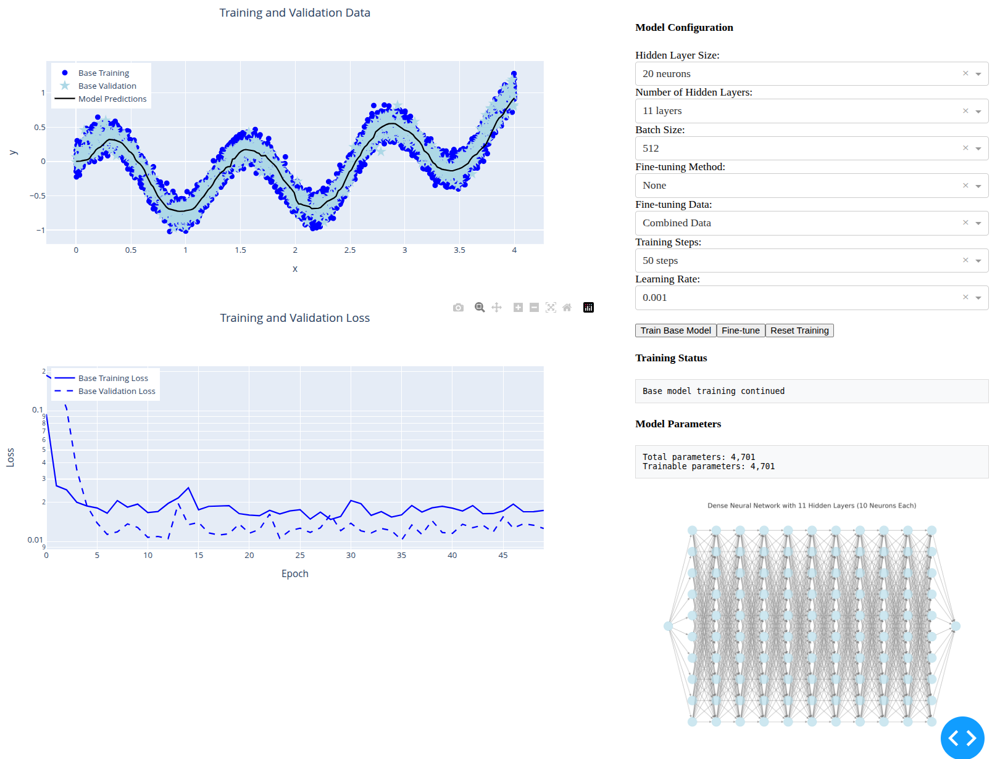

# Neural Networks Interactive Demo

This interactive demo was presented as part of the [Understanding Gulf Ocean Systems Grants Seminar Series](https://www.nationalacademies.org/our-work/understanding-gulf-ocean-systems-grants-seminar-series).

## Overview

This application provides an interactive visualization of neural network training fundamentals. It allows users to experiment with different aspects of neural network training in real-time, making it an excellent educational tool for understanding deep learning concepts.

## Features

- **Multiple Dataset Types**:
  - Linear data
  - Non-linear data
  - Binary classification data

- **Various Model Architectures**:
  - Single Neuron
  - Multi-layer Network
  - Deep Network (20 layers)
  - Deep Network with Batch Normalization
  - Binary Classifier

- **Interactive Training Controls**:
  - Step-by-step training
  - Batch training (500 steps)
  - Adjustable learning rate
  - Configurable batch size
  - Variable dataset size
  - Model reset functionality

- **Real-time Visualizations**:
  - Data points (training, validation, and test sets)
  - Model predictions
  - Training and validation loss curves
  - Backpropagation computations
  - Model parameters

## Installation

1. Clone this repository:
```bash
git clone git@github.com:olmozavala/intro_to_ai_in_oceanography.git
```

2. Install the required dependencies:
```bash
pip install torch numpy dash plotly
```

## Usage

1. Run the application:
```bash
python app.py
```

2. Open your web browser and navigate to:
```
http://localhost:8050
```

## File Structure

- `app.py`: Main Dash application with the interactive interface
- `models.py`: Neural network model architectures
- `data.py`: Dataset generation functions
- `training.py`: Training logic and optimization

## How to Use

1. Select a dataset type (Linear, Non-linear, or Classification)
2. Choose a model architecture
3. Configure training parameters:
   - Number of data points
   - Batch size
   - Learning rate
4. Use the control buttons:
   - 'Step' for single training step
   - 'Step 500' for batch training
   - 'Reset' to reinitialize the model
5. Enable 'Show Backpropagation' to view detailed computations
6. Monitor training progress through:
   - Main plot showing data and model predictions
   - Loss plot showing training and validation losses
   - Model parameters display

## Educational Features

- Visualize how different model architectures learn
- Understand the impact of hyperparameters
- See backpropagation in action
- Compare training behaviors with different optimizations (e.g., batch normalization)
- Observe overfitting and underfitting in real-time

## Interface Preview



The interface provides a comprehensive view of the neural network training process:
- Left panel: Training controls and model configuration
- Center: Real-time visualization of data and model predictions
- Right: Loss curves and model parameters
- Bottom: Backpropagation visualization (when enabled)

## License

MIT License

Copyright (c) 2024 [Your Name or Organization]

Permission is hereby granted, free of charge, to any person obtaining a copy
of this software and associated documentation files (the "Software"), to deal
in the Software without restriction, including without limitation the rights
to use, copy, modify, merge, publish, distribute, sublicense, and/or sell
copies of the Software, and to permit persons to whom the Software is
furnished to do so, subject to the following conditions:

The above copyright notice and this permission notice shall be included in all
copies or substantial portions of the Software.

THE SOFTWARE IS PROVIDED "AS IS", WITHOUT WARRANTY OF ANY KIND, EXPRESS OR
IMPLIED, INCLUDING BUT NOT LIMITED TO THE WARRANTIES OF MERCHANTABILITY,
FITNESS FOR A PARTICULAR PURPOSE AND NONINFRINGEMENT. IN NO EVENT SHALL THE
AUTHORS OR COPYRIGHT HOLDERS BE LIABLE FOR ANY CLAIM, DAMAGES OR OTHER
LIABILITY, WHETHER IN AN ACTION OF CONTRACT, TORT OR OTHERWISE, ARISING FROM,
OUT OF OR IN CONNECTION WITH THE SOFTWARE OR THE USE OR OTHER DEALINGS IN THE
SOFTWARE.